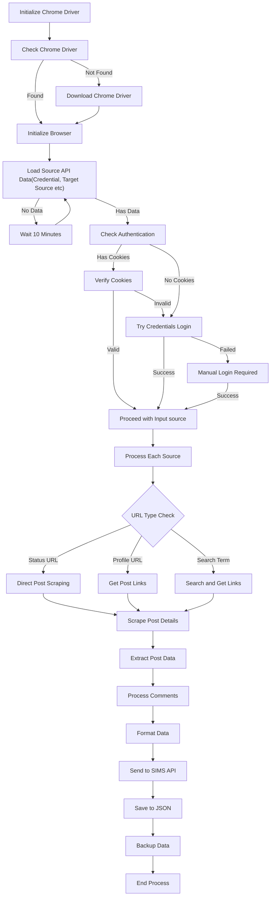

# SIMS Worker Service

This service integrates with the SIMS dashboard API and performs automated tasks.

## Local Setup

1. Install required dependencies:
   ```bash
   pip install -r requirements.txt
   ```

2. Run the main script:
   ```bash
   python twitter.py
   ```

The script will automatically:
- Connect to SIMS dashboard API
- Fetch required data
- Process according to configured settings

## Docker Deployment

To run the service using Docker:

```bash
sudo docker compose up -d sims_worker_x
```

This will:
- Build the container if not already built
- Start the service in detached mode
- Run the worker process in the background

## Note

Make sure you have the proper credentials and environment variables set up before running the service.

## Process Flow



### Detailed Process Description

1. **Initialization Phase**
   - Check for Chrome driver
   - Download if not found
   - Initialize browser with specific options:
     - Disable notifications
     - No sandbox mode
     - Disable dev-shm-usage
     - Disable automation flags
     - Disable infobars

2. **Source Data Processing**
   - Load data from source API
   - If no data available, wait 10 minutes and retry
   - Process each source URL in the data

3. **Authentication Flow**
   - Try loading saved cookies
   - If cookies exist, verify by checking header element
   - If cookies invalid or not found:
     - Attempt login with credentials from source data
     - If credential login fails, prompt for manual login
     - Save cookies after successful login

4. **URL Processing**
   - Check URL type:
     - Status URL: Direct post scraping
     - Profile URL: Get post links using ID
     - Search Term: Search and get relevant links

5. **Post Scraping**
   - Navigate to post URL
   - Extract post details:
     - Post source
     - Post text
     - Post time
     - Reactions (Love, Comments, Shares)
     - Featured images
     - URL screenshot

6. **Comment Processing**
   - Get total comments count
   - Process each comment:
     - User details (name, profile pic, profile URL)
     - Comment text
     - Comment time
     - Process replies if available
     - Handle "Show more" functionality

7. **Data Handling**
   - Format scraped data
   - Send to SIMS API
   - Save to JSON file
   - Create backup
   - Handle errors and retries

### Error Handling
- Chrome driver initialization errors
- Authentication failures
- Network errors during scraping
- Element not found exceptions
- API response errors
- JSON processing errors

### Monitoring
- Log each step of the process
- Track scraping duration
- Monitor API responses
- Record success/failure status
- Maintain backup of scraped data 