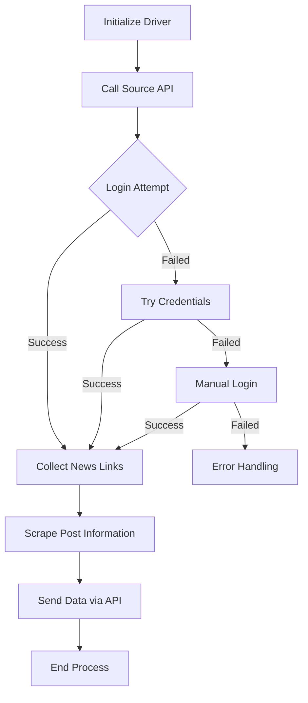

# SIMS Worker Service

This service integrates with the SIMS dashboard API and performs automated tasks.

## Local Setup

1. Install required dependencies:
   ```bash
   pip install -r requirements.txt
   ```

2. Run the main script:
   ```bash
   python twitter.py
   ```

The script will automatically:
- Connect to SIMS dashboard API
- Fetch required data
- Process according to configured settings

## Docker Deployment

To run the service using Docker:

```bash
sudo docker compose up -d sims_worker_x
```

This will:
- Build the container if not already built
- Start the service in detached mode
- Run the worker process in the background

## Note

Make sure you have the proper credentials and environment variables set up before running the service.

## Process Flow



The process follows these steps:
1. Initialize the web driver
2. Call the source API
3. Attempt login in sequence:
   - First try with cookies
   - If failed, try with credentials
   - If still failed, attempt manual login
4. Collect news links from source API
5. Scrape post information from collected links
6. Send the scraped data through API
7. End the process 