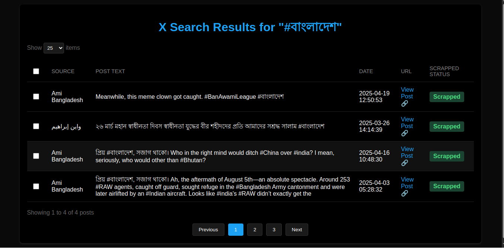

# X (Twitter) Search Bot

A Python-based bot that searches and collects posts from X (formerly Twitter) based on specific keywords and timeframes.

## Screenshot


The interface provides:
- Dark mode UI
- Searchable and filterable results
- Pagination controls
- Status indicators for scrapped content
- Direct links to original posts
- Bulk selection capabilities
- Adjustable items per page

## Features

- Automated X (Twitter) search and post collection
- Duplicate post removal
- JSON output of search results
- Cookie-based authentication for persistent login
- Automatic Chrome driver management
- Configurable search parameters
- Modern dark-themed UI for viewing results
- Pagination and filtering options

## Requirements

- Python 3.x
- Chrome browser
- Required Python packages (install using `pip install -r requirements.txt`):
  - selenium
  - python-dotenv
  - get-chrome-driver

## Configuration

1. Create a `.env` file in the project root with the following variables:
```
POST_XPATH=your_post_xpath
POST_TEXT=your_post_text_xpath
SOURCE_PATH=your_source_xpath
LINK_XPATH=your_link_xpath
```

2. Update the search parameters in `main.py`:
```python
days_ago = datetime.now() - timedelta(days=7)  # Adjust time window
x_key = "#বাংলাদেশ"  # Change search keyword
```

## How It Works

1. **Authentication**:
   - Uses cookie-based authentication
   - Saves cookies after first login
   - Reuses cookies for subsequent runs

2. **Search Process**:
   - Enters search keyword
   - Scrolls through results
   - Collects posts matching criteria
   - Removes duplicates while preserving order

3. **Post Collection**:
   - Collects source text
   - Collects post text
   - Records post time
   - Saves post link

4. **Output**:
   - Saves results to `search_results.json`
   - Generates interactive HTML results page
   - Prints results to console
   - Each post follows the format: `source_text _69_ post_text _69_ time_element _69_ post_link`

## Usage

1. Install dependencies:
```bash
pip install -r requirements.txt
```

2. Configure your `.env` file with appropriate XPath values

3. Run the script:
```bash
python main.py
```

4. For first run, you may need to manually log in when prompted

## Output Format

The script generates two types of output:

1. **Interactive HTML Page**:
   - Dark-themed modern interface
   - Sortable and filterable results
   - Pagination controls
   - Status indicators
   - Direct links to posts

2. **JSON File** (`search_results.json`):
```json
[
    {
        "source_text": "source text here",
        "post_text": "post text here",
        "time_element": "time here",
        "post_link": "link here"
    }
]
```

## Notes

- The script includes automatic Chrome driver management
- Duplicate posts are removed based on exact content matching
- The search window can be adjusted in the code
- Make sure to respect X's terms of service and rate limits

## Troubleshooting

1. **Login Issues**:
   - Clear cookies and try manual login
   - Check if X has changed their login process

2. **XPath Errors**:
   - Update XPath values in `.env` file
   - Check if X has updated their page structure

3. **Chrome Driver Issues**:
   - The script will attempt to download the correct driver version
   - Make sure Chrome is installed and up to date

## License

This project is licensed under the MIT License - see the LICENSE file for details.