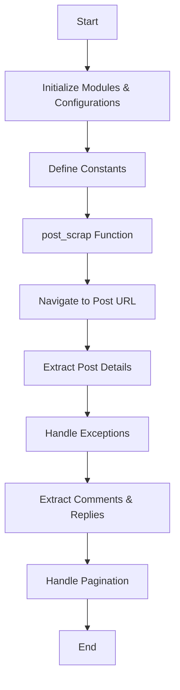

# Twitter Scraper

This project is a Twitter scraper that uses Selenium to extract data from Twitter posts, including post details, comments, and reactions.

## Main Script: `main.py`

### Flowchart

### Functions

- **clickshowmore()**: Clicks "Show more" buttons to load additional content.
- **post_scrap(post_url, browser)**: Scrapes data from a given post URL, including posted time, source, text, comments, and reactions.

### Usage

1. Ensure you have Selenium installed and configured with the appropriate WebDriver.
2. Run the `main.py` script to start scraping.

### Updated Requirements

- Python 3.x
- Selenium
- Chrome WebDriver
- python-dotenv
- webdriver-manager

### Additional Information

- The script now includes functionality to save and load cookies for session management.
- Ensure that the `.env` file is configured correctly for environment variables used in the script.

### Notes

- The script handles exceptions for elements not found and retries where necessary.
- Ensure your WebDriver is up to date with your browser version. 
